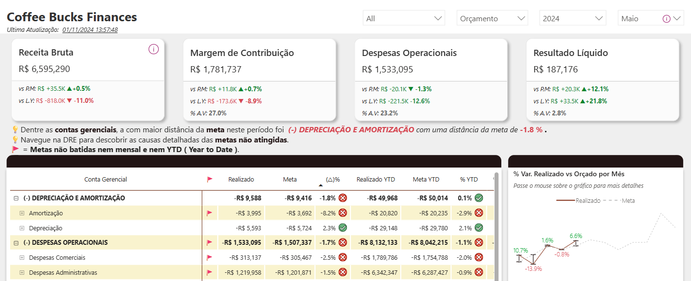
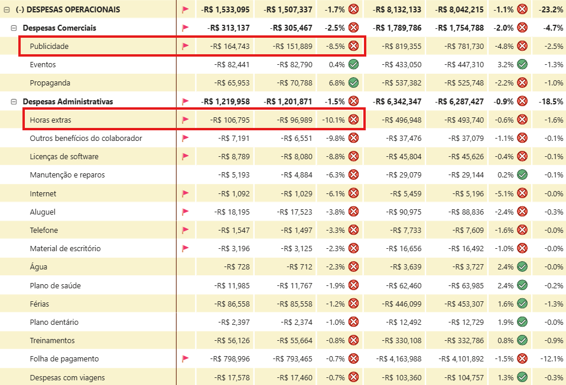
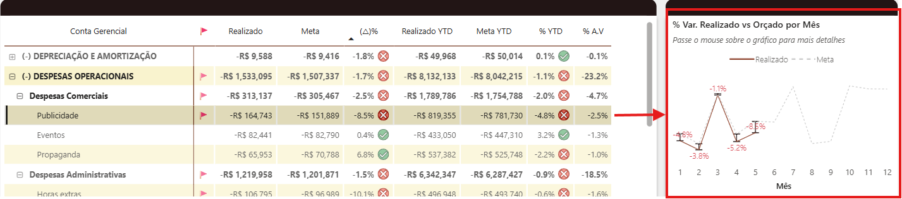
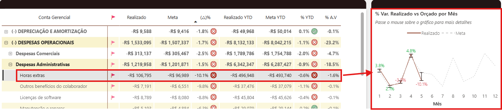

# Coffee Bucks Finances 🍵

## Cenário e objetivo

Este projeto de Business Intelligence (BI) tem como objetivo analisar a saúde financeira da cafeteria Coffee Bucks, utilizando dados para identificar oportunidades de melhoria e apoiar a tomada de decisão.
O objetivo
- Avaliar receitas, despesas e lucros.
- Analisar custos fixos e variáveis.
- Detectar possíveis gargalos financeiros.
- Gerar recomendações para melhorar a performance financeira.

## Sobre o negócio

A Coffee Bucks é uma empresa especializada na venda de cafés premium em grãos selecionados de diversas regiões, com operações em São Paulo, Florianópolis e Rio de Janeiro. Além de atender diretamente os **consumidores finais**, a Coffee Bucks também busca expandir seus serviços para o setor **corporativo**. Para isso, a empresa deverá utilizar os insights obtidos a partir dos dados financeiros, permitindo a personalização de soluções corporativas e uma **melhor alocação de recursos** para melhor direcionamento do negócio.

Para auxiliar a empresa a entender como seus recursos estão sendo utilizados, foi desenvolvido um relatório utilizando Power BI que monitora indicadores, como, receita, margem de contribuição, despesas e resultado líquido, além de comparar com os valores planejados e orçados. Com ajuda de elementos visuais, é possível identificar rapidamente quais áreas necessitam de atenção, melhorando a rapidez para ação, além de ir no **ponto crucial do processo**.

Para ver o painel acesse o link: [Link do Painel](https://app.powerbi.com/view?r=eyJrIjoiMTNjMWE4YzUtZTdhZC00MTEzLTk2NTMtY2Y3M2NiNjAzNWU0IiwidCI6ImIzYWUzNDliLThjZTktNDc2Yi05ZWJlLTY1Y2NhNzdlZDA4ZiJ9)

## Ferramentas Utilizadas

- Power BI ➡️ Conexão com a fonte de dados, tratamentos e visualização
- Fonte de dados: Arquivos.csv

## Principais Indicadores

- Comparativo entre períodos (Realizado Vs Mês anterior, Realizado vs Ano Anterior)
- Evolução do realizado vs Orçado/Previsto Mensal
- Análise de custos operacionais ( Planos de contas detalhados )

## Análises e Recomendações

Como um ambiente corporativo é dinâmico e de rápidas mudanças, o foco aqui é no último período disponível, visto que são análises de performance financeira operacional.

O primeiro ponto de atenção aqui são as despesas `Depreciação e Amortização` e `Despesas Operacionais`. Como pode-se ver na imagem, quando ordenamos pela variação do Orçado (`(∆)%,`) essas são as 2 com a maior distância do realizado x Orçado.

Apesar disso, baseado na receita bruta e valor dessas dívidas, as `Despesas Operacionais` são as que, em valor absoluto (R$), geram a maior despesa, e dessa forma corrigir isso (se possível) gerará um impacto financeiro maior. Com isso em mente, vamos detalhar mais a conta de `Despesas Operacionais`.

Dentre as despesas operacionais mais especificamente `Publicidade`dentro de `Despesas Comerciais`e `Horas Extras`dentro de `Despesas Administrativas`, juntas acumularam **R$ 22.660** de dividas não esperadas.

**Recomendações**: 

#### Publicidade: 

Ao analisar o histórico da conta de `Publicidade` ao longo dos meses deste ano (imagem abaixo), fica evidente que, em todos os períodos, o valor realizado superou o orçado. Esse padrão sugere a necessidade de aprimorar o processo de aprovação das campanhas, adotando controles mais rigorosos e garantindo o respeito ao teto de gastos planejado.

Outra hipótese que pode ser investigada, é que possivelmente o orçamento destinado às campanhas esteja subestimado. Para investigar essa hipótese, é importante analisar detalhadamente os dados das campanhas anteriores e verificar se existe potencial para obter o mesmo impacto financeiro com investimentos menores. Essa análise deve ser feita em conjunto com a revisão do processo de aprovação, visando otimizar os gastos e aumentar a eficiência das ações.

#### Horas Extras:

Já relacionado às horas extras, verificando também a evolução do realizado com o orçado, vê se que foi um problema mais pontual do que generalizado. 

#### Horas Extras:

Ao analisar a evolução da conta de `Horas Extras` ao longo dos meses (imagem abaixo), observa-se que o estouro do orçamento foi pontual, concentrado em poucos meses, e não um padrão recorrente como em Publicidade.

**Sugestões de ações para o contexto atual:**

- **Revisar os meses com maior variação:**  
  Para aprofundar essa análise, é importante identificar as possíveis causas do aumento das horas extras nos meses específicos. Entre os fatores que **podem ter contribuído** estão:
  - **Picos de demanda:** Eventos sazonais, promoções ou aumento inesperado no fluxo de clientes podem exigir mais trabalho dos colaboradores.
  - **Ausência de funcionários:** Férias, licenças médicas ou afastamentos podem gerar necessidade de compensação por outros membros da equipe.
  - **Projetos excepcionais:** Implementação de novos sistemas, treinamentos ou mudanças operacionais podem demandar horas extras temporárias.
  - **Planejamento inadequado:** Falhas na previsão de demanda ou na alocação de recursos podem resultar em sobrecarga de trabalho.

 - Após identificar as causas, as seguintes ações podem ser tomadas:
    - **Ajustar o planejamento de pessoal:** Antecipar contratações temporárias ou` redistribuir tarefas para períodos críticos`.
    - **Monitorar indicadores de absenteísmo:** Acompanhar ausências para agir preventivamente e evitar sobrecarga.
    - **Avaliar processos internos:** Identificar oportunidades de `automação ou melhoria de processos` para reduzir a necessidade de horas extras.
    - **Comunicação com gestores:** Orientar líderes sobre o impacto financeiro das horas extras e reforçar a importância do controle orçamentário.

Essas ações ajudarão a mitigar o impacto financeiro das horas extras e promovem uma gestão de recursos mais eficiente.